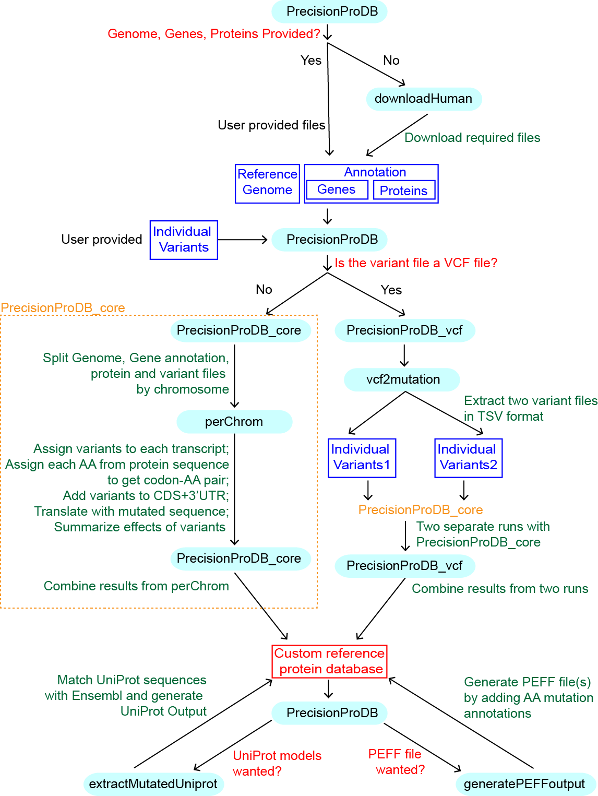
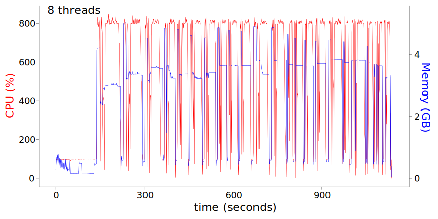
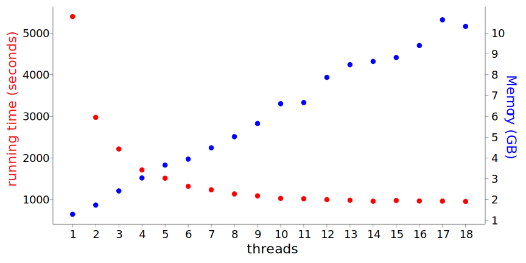

# PrecisionProDB

**PrecisionProDB (Precision protein database), a tool improving the proteomics performance for precision medicine.**

PrecisionProDB is a Python package for proteogenomics, which can generate a customized protein database for peptide search in mass spectrometry.

PrecisionProDB2 has been developed to maintain compatibility with the previous version of the software. Notably, it introduces the option of utilizing SQLite files for the storage of intermediate data. This innovation has significantly reduced the runtime of the program, particularly when handling smaller VCF files.

[For more help information, visit the wiki page.](https://github.com/ATPs/PrecisionProDB/wiki)

[For more running examples, visit the example folder](/examples/)

- [PrecisionProDB](#precisionprodb)
- [Description](#description)
- [Installation](#installation)
  - [Install required packages with `conda`](#install-required-packages-with-conda)
  - [Install required packages with `pip`](#install-required-packages-with-pip)
  - [Install PrecisionProDB](#install-precisionprodb)
- [Citing PrecisionProDB](#citing-precisionprodb)
- [Usage Information](#usage-information)
  - [Typical usage](#typical-usage)
    - [The most simple case](#the-most-simple-case)
    - [VCF with multiple samples](#vcf-with-multiple-samples)
    - [VCF with local gene annotation](#vcf-with-local-gene-annotation)
    - [Variant file in text format](#variant-file-in-text-format)
    - [User-provided gene models](#user-provided-gene-models)
  - [Testing with example files](#testing-with-example-files)
    - [Variant file in VCF format](#variant-file-in-vcf-format)
    - [Variant file in text format](#variant-file-in-text-format-1)
  - [Get help information for each module](#get-help-information-for-each-module)
- [Outputs](#outputs)
  - [Count number of changed proteins](#count-number-of-changed-proteins)
  - [Count number of changed amino acids (AAs)](#count-number-of-changed-amino-acids-aas)
  - [Further comparison](#further-comparison)
- [Benchmark](#benchmark)
  - [CPU/Memory consumption with 8 threads](#cpumemory-consumption-with-8-threads)
  - [Running time and required memory with different threads](#running-time-and-required-memory-with-different-threads)
- [PrecisionProDB\_references](#precisionprodb_references)
- [Contact Information](#contact-information)


# Description
The major goal of PrecisionProDB is to generate personized protein sequences for protein identification in mass spectrometry (MS). 
Main features:
* Supports multithreading, which improves the speed of the program. A typical customized human protein database can be generated in 15 to 20 mins using 8 threads.  
* Optimized for several widely used human gene models, including:
  * [GENCODE](https://www.gencodegenes.org/human/): PrecisionProDB can download the latest version from `ftp://ftp.ebi.ac.uk/pub/databases/gencode/Gencode_human`, as shown in `https://www.gencodegenes.org/human/`.
  * [RefSeq](https://www.ncbi.nlm.nih.gov/genome/guide/human/): PrecisionProDB can download the latest version from `ftp://ftp.ncbi.nlm.nih.gov/genomes/refseq/vertebrate_mammalian/Homo_sapiens/annotation_releases/current`
  * [Ensembl](https://useast.ensembl.org/Homo_sapiens/Info/Index): PrecisionProDB can download the latest version from:
    * `ftp://ftp.ensembl.org/pub/current_fasta/homo_sapiens/dna/`
    * `ftp://ftp.ensembl.org/pub/current_gtf/homo_sapiens/`
    * `ftp://ftp.ensembl.org/pub/current_fasta/homo_sapiens/pep/`
  * [UniProt](https://www.uniprot.org/taxonomy/9606): PrecisionProDB can download the latest version from:
    * `ftp://ftp.uniprot.org/pub/databases/uniprot/current_release/knowledgebase/reference_proteomes/Eukaryota/`
    * The files are `UP000005640/UP000005640_9606.fasta.gz` and `UP000005640/UP000005640_9606_additional.fasta.gz`, which may change in the future.
* The non-standard codons and rare amino acids (e.g. Selenocysteine (**Sec** or **U**)) in the human genome can be properly incorporated.
* Internal stops (*) in proteins were reserved.
* Supports variant file in text or VCF format.
* All input files can be in compressed gzip (.gz) format.
* Supports user generated gene models in GTF/GFF format. Species other than human are also supported.
  * For user-generated GTF files, protein annotations generated by [TransDecoder](https://github.com/TransDecoder/TransDecoder/wiki) was tested. 
  * We provided [an example of running TransDecoder with example files](https://github.com/ATPs/PrecisionProDB/wiki/An-Example-of-Running-TransDecoder).

The figure below shows how PrecisionProDB works:


# Installation

## Install required packages with `conda`

PrecisionProDB is tested under the `base` enviroment of [Anaconda](https://www.anaconda.com/products/individual). It requires Python3, [Biopython](https://biopython.org/) and [Pandas](https://pandas.pydata.org/).
If Anaconda is installed, only Biopython need to be installed:

```bash
conda install -c anaconda biopython
```

Otherwise, it is recommended to use the [conda](https://github.com/conda/conda) to control the packages and [virtual environement](https://virtualenv.pypa.io/en/latest/). Install required packages:
```bash
conda install numpy
conda install pandas
conda install -c conda-forge biopython
```
## Install required packages with `pip`
If `conda` is not installed, `pip` (or `pip3` as Python3 is required) can be used. `pip` is already installed if you are using Python3 >=3.4 downloaded from python.org.

```bash
pip3 install numpy
pip3 install pandas
pip3 install biopython
```
If the user has no root previlige on the system, the packages can be installed using the "--user" option:

```bash
pip3 install numpy --user USER
pip3 install pandas --user USER
pip3 install biopython --user USER
```
`USER` is the user name on the operating system to install these packages.


## Install PrecisionProDB

To install the latest developments:
```bash
git clone https://github.com/ATPs/PrecisionProDB.git
```

To install other verisons, download from the [release page](https://github.com/ATPs/PrecisionProDB/releases) directly.

# Citing PrecisionProDB

Xiaolong Cao, Jinchuan Xing, PrecisionProDB: improving the proteomics performance for precision medicine, Bioinformatics, Volume 37, Issue 19, October 2021, Pages 3361–3363, https://doi.org/10.1093/bioinformatics/btab218

# Usage Information

**Note**: `python` in the example scripts below are Python3. If you are unsure about the version of your python, use `python --version` to show the version. In some systems you might need to use `python3` to specify Python3, or use the full name of `Pythons` (e.g., `/home/xcao/p/anaconda3/bin/python3.7`), if multiple versions of `Python` exist in the system or `Python` is not in the system PATH.

## Typical usage
### The most simple case

We suppose that in most cases, users will have a variant file in [VCF](https://samtools.github.io/hts-specs) format. If there is only one sample in the VCF file, the simplest command will be:
```bash
python Path_of_PrecisionProDB/src/PrecisionProDB.py -m Name_of_variant_file -D GENCODE -o Prefix_of_output
```
- `-m Name_of_variant_file` defines the input variant file (include the full path if the input file is not in the current folder). If the variant file ends with '.vcf' (case ignored), it will be treated as a [VCF](https://samtools.github.io/hts-specs) file. In all other cases a file will be treated as a [TSV](https://en.wikipedia.org/wiki/Tab-separated_values) file. Files end with '.gz' (e.g., '.vcf.gz' or '.tsv.gz') will be treated as gzip compressed files.
- `-D GENCODE` defines the annotation reference to be used. In this example, personalized protein sequences based on the `GENCODE` annotation will be generated. PrecisionProDB will download required files of GENCODE models automatically. To use gene models in other supported resources, `GENCODE` could be changed to `RefSeq`, `Ensembl` or `Uniprot`.  
- `-o Prefix_of_output` defines the prefix of the output filenames.

### VCF with multiple samples
If there are multiple samples in the VCF file, the `-s` option should be used to specify the sample name to be used in the VCF file.
```bash
python Path_of_PrecisionProDB/src/PrecisionProDB.py -m Name_of_variant_file -D GENCODE -o Prefix_of_output -s Sample_name
```

### VCF with local gene annotation
If there is a local version of gene annotation files from Ensembl, the command will be:
```bash
python Path_of_PrecisionProDB/src/PrecisionProDB.py -m Name_of_variant_file -o Prefix_of_output -s Sample_name -g Ensembl_Genome -p Ensembl_protein -f Ensembl_gtf -a Ensembl_GTF
```
Ensembl_Genome, Ensembl_protein, and Ensembl_gtf are the locations of the Ensembl genome, protein, and GTF files, respectively. These files can be downloaded from Ensembl website as metioned previously, or use the `downloadHuman` module in the package.
```bash
python Path_of_PrecisionProDB/src/downloadHuman.py -d Ensembl -o Output_folder
```
Output_folder is the path of output folder to store the downloaded files.

### Variant file in text format

If the variant file is in the tab-separated values ([TSV](https://en.wikipedia.org/wiki/Tab-separated_values)) format, 
- it needs to include a header row, with at least four columns: `chr`, `pos`, `ref`, `alt`. There is no requirement for the order of these columns, as `pandas` was used to parse the file.
- additional columns are allowed, but will be ignored.
- the `chr`, `pos`, `ref` and `alt` columns were coded in the VCF format. This means that for deletions, it should be written as `chr1 10146 AC A`, rather than `chr1 10147 C . `. Also, the `pos` is 1-based like in the VCF file, not 0-based (in bed file).

- The most simple text file looks like:

  |   chr |   pos | ref   | alt   |
  |------:|------:|:------|:------|
  |     1 | 10146 | AC    | A     |
  |     1 | 15274 | A     | G     |
  |     1 | 28563 | A     | G     |
  |     1 | 49298 | T     | C     |
  |     1 | 52238 | T     | G     |


```bash
python Path_of_PrecisionProDB/src/PrecisionProDB.py -m Name_of_variant_file -D GENCODE -o Prefix_of_output
```

- `Name_of_variant_file` is the name of the variant file. If the variant file ends with '.vcf' (case ignored), it will be treated as a [VCF](https://samtools.github.io/hts-specs) file, as described above. In all other cases a file will be treated as a [TSV](https://en.wikipedia.org/wiki/Tab-separated_values) file. Files end with '.gz' (e.g., '.vcf.gz' or '.tsv.gz') will be treated as gzip compressed files.
- For text file format input, `-s` option will be ignored as there is only one sample.
- Here, `-D` is set to be `GENCODE`. GENCODE related files will be downloaded.

### User-provided gene models
We tested GTF annotation generated by [TransDecoder](https://github.com/TransDecoder/TransDecoder/wiki).  
Run TransDecoder in the [starting from a genome-based transcript structure GTF file](https://github.com/TransDecoder/TransDecoder/wiki#starting-from-a-genome-based-transcript-structure-gtf-file-eg-cufflinks-or-stringtie) mode.
```bash
python Path_of_PrecisionProDB/src/PrecisionProDB.py -m Name_of_variant_file -o Prefix_of_output -s Sample_name -g TransDecoder_Genome -p TransDecoder_protein -f TransDecoder_gtf -a gtf
```

## Testing with example files

### Variant file in VCF format

```bash
cd Path_of_PrecisionProDB/examples
python ../src/PrecisionProDB.py -m celline.vcf.gz -g GENCODE.genome.fa.gz -p GENCODE.protein.fa.gz -f GENCODE.gtf.gz -o vcf_variant
```
Five files will be generated in the `examples` folder.
- `vcf_variant.pergeno.aa_mutations.csv`: annotations of amino acid changes.
- `vcf_variant.pergeno.protein_all.fa`: all proteins after incoporating the variants.
- `vcf_variant.pergeno.protein_changed.fa`: all proteins which are different from the input protein sequences after incoporating the variants.
- `vcf_variant.vcf2mutation_1.tsv`: variant file extracted from the VCF file in text format, the first alternative alleles.
- `vcf_variant.vcf2mutation_2.tsv`: variant file extracted from the VCF file in text format, the second alternative alleles.

Note:

* For altered proteins, `__1`, `__2`, `__12` will be added to the ID of the protein. 
  * `__1` and `__2` mean that the alleles of the protein is from the first and the second variant file, respectively. 
  * `__12` means that the the altered protein sequence are the same for the first and the second alleles. 
  * e.g., `>ENSP00000308367.7|ENST00000312413.10|ENSG00000011021.23|OTTHUMG00000002299|-|CLCN6-201|CLCN6|847__12   changed`, `ENSP00000263934.6|ENST00000263934.10|ENSG00000054523.18|OTTHUMG00000001817|OTTHUMT00000005103.1|KIF1B-201|KIF1B|1770__2        changed`, `ENSP00000332771.4|ENST00000331433.5|ENSG00000186510.12|OTTHUMG00000009529|OTTHUMT00000026326.1|CLCNKA-201|CLCNKA|687__1        changed`, `ENSP00000493376.2|ENST00000641515.2|ENSG00000186092.6|OTTHUMG00000001094|OTTHUMT00000003223.1|OR4F5-202|OR4F5|326      unchanged`.
* The variant file looks like
  ```
  chr     pos     ref     alt
  chr1    52238   T       G
  chr1    53138   TAA     T
  chr1    55249   C       CTATGG
  chr1    55299   C       T
  chr1    61442   A       G
  ```


### Variant file in text format
```bash
cd Path_of_PrecisionProDB/examples
python ../src/PrecisionProDB.py -m gnomAD.variant.txt.gz -g GENCODE.genome.fa.gz -p GENCODE.protein.fa.gz -f GENCODE.gtf.gz -o text_variant
```
Three files will be generated in the `examples` folder.
- `text_variant.pergeno.aa_mutations.csv`: amino acid change annotations
- `text_variant.pergeno.protein_all.fa`: all proteins after incoporating the variants.
- `text_variant.pergeno.protein_changed.fa`: all proteins which are different from the input protein sequences after incoporating the variants.

Note:
* Protein names and descriptions in the fasta file are the same as in the input protein file, and the `Tab` symbol (`\t`) + `changed` or `unchanged` were added to indicate if the protein sequence is altered. 
* e.g., `ENSP00000328207.6|ENST00000328596.10|ENSG00000186891.14|OTTHUMG00000001414|OTTHUMT00000004085.1|TNFRSF18-201|TNFRSF18|255  unchanged`, `ENSP00000424920.1|ENST00000502739.5|ENSG00000162458.13|OTTHUMG00000003079|OTTHUMT00000368044.1|FBLIM1-210|FBLIM1|144   changed`.


## Get help information for each module
There are several files in the `src` folder. Each of them were designed in a way that can be run independently. To get help, run

```bash
python Path_of_PrecisionProDB/src/MODULE_NAME.py -h
```
where `MODULE_NAME` should be the files in the `src` folder, without the `.py` extension.

To get help for the main program, run

```bash
python Path_of_PrecisionProDB/src/PrecisionProDB.py -h
```

[The printed message were provided on the wiki page, where further explanations can be found.](https://github.com/ATPs/PrecisionProDB/wiki/PrecisionProDB-parameters)


# Outputs
[For information, visit the wiki page.](https://github.com/ATPs/PrecisionProDB/wiki/Outputs-of-PrecisionProDB)
https://github.com/ATPs/PrecisionProDB/wiki/Outputs-of-PrecisionProDB

## Count number of changed proteins
The number of altered proteins will be shown during running PrecisonProDB. In the header line of "PREFIX.pergeno.protein_all.fa", a word "changed" or "unchanged" is at the end of the fasta header, and users may count the number of changed proteins based on this annotation.

## Count number of changed amino acids (AAs)
Generally, users may found annotations for variants in the "PREFIX.pergeno.aa_mutations.csv" file. Users may get the effects of different variants including AA subsitutions, insertions, deletions, stop-loss, stop-gain, and frame-changes.

## Further comparison
Users may use tools like https://github.com/pwilmart/fasta_utilities to further compare the difference of trypsin digested peptides.

# Benchmark

Tested with a computing node with Intel Xeon CPU E5-2695 v4 @ 2.10GHz and 256GB memory, with GENCODE gene models and a variant file in text format from gnomAD 3.1 as input.

* Depending on the available resources, a `thread` of 8 to 12 is recommendded.
* If the variant file is in text format, typical running time will be 15 to 20 minutes
* If the variant file is in VCF format, typical running time will be 30 to 40 minutes.

## CPU/Memory consumption with 8 threads



## Running time and required memory with different threads



# PrecisionProDB_references

[The Genome Aggregation Database (gnomAD) project](https://gnomad.broadinstitute.org/), provide variant allele frequencies in different populations based on genomes and exomes of hundreds of thousands of individuals and this information can be integrated into a protein database. We applied PrecisionProDB to alleles from different populations from gnomAD 3.1 data. Results can be found at https://github.com/ATPs/PrecisionProDB_references.


# Contact Information
Please leave comments on the [**issue**](https://github.com/ATPs/PrecisionProDB/issues) tab.


