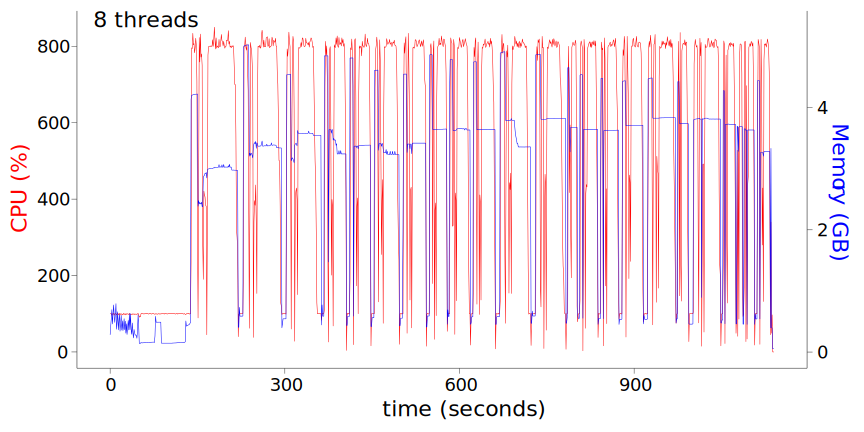
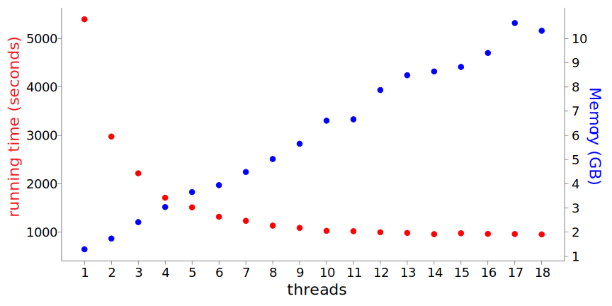

# PrecisionProDB

**PrecisionProDB (Precision protein database), a tool improving the proteomics performance for precision medicine.**

[The Genome Aggregation Database (gnomAD) project](https://gnomad.broadinstitute.org/), provide variant allele frequencies in different populations based on genomes and exomes of hundreds of thousands of individuals and this information can be integrated into a protein database. We applied PrecisionProDB to alleles from different populations from gnomAD 3.1 data. Results can be found at https://github.com/ATPs/PrecisionProDB_references.

- [PrecisionProDB](#precisionprodb)
- [Description](#description)
- [Installation](#installation)
- [Citing PrecisionProDB](#citing-precisionprodb)
- [Usage Information](#usage-information)
  - [Typical usage](#typical-usage)
    - [The most simple case](#the-most-simple-case)
    - [VCF with multiple samples](#vcf-with-multiple-samples)
    - [VCF with local gene annotation](#vcf-with-local-gene-annotation)
    - [variant file in text format](#variant-file-in-text-format)
    - [user provided gene models](#user-provided-gene-models)
  - [get help information for each module](#get-help-information-for-each-module)
- [Outputs](#outputs)
- [Benchmark](#benchmark)
  - [CPU/Memory consumption with 8 threads](#cpumemory-consumption-with-8-threads)
  - [Running time and required memory with different threads](#running-time-and-required-memory-with-different-threads)
- [Contact Information](#contact-information)

# Description
The major goal is to generate personized protein sequences for protein identification in mass spectrometry (MS). 
* PrecisionProDB supports multithreading, which makes it fast to get the results. 
* It is optimized for several widely used human gene models, including:
  * [GENCODE](https://www.gencodegenes.org/human/): PrecisionProDB can download the latest version from `ftp://ftp.ebi.ac.uk/pub/databases/gencode/Gencode_human`, as shown in `https://www.gencodegenes.org/human/`.
  * [RefSeq](https://www.ncbi.nlm.nih.gov/genome/guide/human/): PrecisionProDB can download the latest version from `ftp://ftp.ncbi.nlm.nih.gov/genomes/refseq/vertebrate_mammalian/Homo_sapiens/annotation_releases/current`
  * [Ensembl](https://useast.ensembl.org/Homo_sapiens/Info/Index): PrecisionProDB can download the latest version from:
    * `ftp://ftp.ensembl.org/pub/current_fasta/homo_sapiens/dna/`
    * `ftp://ftp.ensembl.org/pub/current_gtf/homo_sapiens/`
    * `ftp://ftp.ensembl.org/pub/current_fasta/homo_sapiens/pep/`
  * [UniProt](https://www.uniprot.org/taxonomy/9606): PrecisionProDB can download the latest version from:
    * `ftp://ftp.uniprot.org/pub/databases/uniprot/current_release/knowledgebase/reference_proteomes/Eukaryota/UP000005640_9606.fasta.gz`
    * `ftp://ftp.uniprot.org/pub/databases/uniprot/current_release/knowledgebase/reference_proteomes/Eukaryota/UP000005640_9606_additional.fasta.gz`
* The non-standard codons and rare amino acids (e.g. Selenocysteine (**Sec** or **U**)) in the human genome can be properly taken care.
* It supports variant file in text or VCF format.
* All input files can be in compressed gzip format.
* It supports user generated gene models in GTF/GFF format. Species other than human are also supported.
  * For user-generated GTF files, protein annotations generated by [TransDecoder](https://github.com/TransDecoder/TransDecoder/wiki) was tested. 

# Installation
PrecisionProDB is tested under the `base` enviroment of [Anaconda](https://www.anaconda.com/products/individual). It requires Python3, [Biopython](https://biopython.org/) and [Pandas](https://pandas.pydata.org/).
If Anaconda is installed, only Biopython need to be installed:

```bash
conda install -c anaconda biopython
```

Otherwise, it is recommended to use the [conda](https://github.com/conda/conda) to control the packages and [virtual environement](https://virtualenv.pypa.io/en/latest/). Install required packages:
```bash
conda install -c anaconda biopython
conda install pandas
conda install numpy
```

To install the latest developments:
```bash
git clone https://github.com/ATPs/PrecisionProDB.git
```

To install other verisons, download from the [release page](https://github.com/ATPs/PrecisionProDB/releases) directly.

# Citing PrecisionProDB
The manuscript of PrecisionProDB is submitted and this part will be updated soon.

# Usage Information

## Typical usage
### The most simple case

We suppose that in most case, users will have a variant file in VCF format. If there is only one sample in the VCF format, the command will be like:
```bash
python Path_of_PrecisionProDB/src/PrecisionProDB.py -m Path_of_variant_file -D GENCODE -o Prefix_of_output
```
Prefix_of_output should be changed to the desired setting. In this setting, personalized protein sequences based on GENCODE annotation will be generated. PrecisionProDB will download required files of GENCODE models automatically.  
To get gene models in other supported resources, `GENCODE` could be changed to `RefSeq`, `Ensembl` or `Uniprot`.  
Path_of_variant_file is the path of the VCF file. If the variant file is ends with '.vcf.gz' or '.vcf' (case ignored), it will be treated as a VCF file.

### VCF with multiple samples
If there are multiple samples in the VCF file, `-s` option should be used to include the sample name in the VCF file.
```bash
python Path_of_PrecisionProDB/src/PrecisionProDB.py -m Path_of_variant_file -D GENCODE -o Prefix_of_output -s Sample_name
```

### VCF with local gene annotation
If there is a local version of gene annotation from Ensembl, the command will be:
```bash
python Path_of_PrecisionProDB/src/PrecisionProDB.py -m Path_of_variant_file -o Prefix_of_output -s Sample_name -g Ensembl_Genome -p Ensembl_protein -f Ensembl_gtf -a Ensembl_GTF
```
Ensembl_Genome, Ensembl_protein, Ensembl_gtf is the location of Ensembl genome, protein, GTF files, respectively. These files can be downloaded from Ensembl website as metioned previously, or use the `downloadHuman` module.
```bash
python Path_of_PrecisionProDB/src/downloadHuman.py -d Ensembl -o Output_folder
```
Output_folder is the path of output folder to store the downloaded files.

### variant file in text format
If the variant file is in text format, it need to include a header column, with at least four columns: chr, pos, ref, alt. It should be a tab-separated values (TSV) file. Users need to generate this file. In this case, `-s` option will be ignored as there is only one sample.

```bash
python Path_of_PrecisionProDB/src/PrecisionProDB.py -m Path_of_variant_file -D GENCODE -o Prefix_of_output
```
Path_of_variant_file is the path of the variant file. If the variant file is not ends with '.vcf.gz' or '.vcf' (case ignored), it will be treated as a text file.  
`-D` is set to be `GENCODE`. GENCODE related files will be downloaded.

### user provided gene models
We tested GTF annotation generated by [TransDecoder](https://github.com/TransDecoder/TransDecoder/wiki).  
Run TransDecoder in the [starting from a genome-based transcript structure GTF file](https://github.com/TransDecoder/TransDecoder/wiki#starting-from-a-genome-based-transcript-structure-gtf-file-eg-cufflinks-or-stringtie) mode.
```bash
python Path_of_PrecisionProDB/src/PrecisionProDB.py -m Path_of_variant_file -o Prefix_of_output -s Sample_name -g TransDecoder_Genome -p TransDecoder_protein -f Ensembl_gtf -a gtf
```

## get help information for each module
There are several files in the `src` folder. Each of them were designed in a way that can be run independently. To get help, run

```bash
python Path_of_PrecisionProDB/src/module_name.py -h
```

To get help for the main program, run

```bash
python Path_of_PrecisionProDB/src/PrecisionProDB.py -h
```

The following messages will be printed out.
```ini
usage: PrecisionProDB.py [-h] [-g GENOME] [-f GTF] -m MUTATIONS [-p PROTEIN] [-t THREADS] [-o OUT] [-a {GENCODE_GTF,GENCODE_GFF3,RefSeq,Ensembl_GTF,gtf}]
                         [-k PROTEIN_KEYWORD] [-F] [-s SAMPLE] [-A] [-D {GENCODE,RefSeq,Ensembl,Uniprot,}] [-U UNIPROT] [--uniprot_min_len UNIPROT_MIN_LEN]

PrecisionProDB, personal proteogenomic tools which outputs a new reference protein based on the variants data. VCF/tsv file as the variant input If the variant file is
in tsv format, at least four columns are required in the header: chr, pos, ref, alt. Try to convert the file to proper format if you have a bed or other file.

optional arguments:
  -h, --help            show this help message and exit
  -g GENOME, --genome GENOME
                        the reference genome sequence in fasta format. It can be a gzip file
  -f GTF, --gtf GTF     gtf file with CDS and exon annotations. It can be a gzip file
  -m MUTATIONS, --mutations MUTATIONS
                        a file stores the variants. If the file ends with ".vcf" or ".vcf.gz", treat as vcf input. Otherwise, treat as TSV input
  -p PROTEIN, --protein PROTEIN
                        protein sequences in fasta format. It can be a gzip file. Only proteins in this file will be checked
  -t THREADS, --threads THREADS
                        number of threads/CPUs to run the program. default, use all CPUs available
  -o OUT, --out OUT     output prefix, folder path could be included. Three or five files will be saved depending on the variant file format. Outputs include the
                        annotation for mutated transcripts, the mutated or all protein sequences, two variant files from vcf. {out}.pergeno.aa_mutations.csv,
                        {out}.pergeno.protein_all.fa, {out}.protein_changed.fa, {out}.vcf2mutation_1/2.tsv. default "perGeno"
  -a {GENCODE_GTF,GENCODE_GFF3,RefSeq,Ensembl_GTF,gtf}, --datatype {GENCODE_GTF,GENCODE_GFF3,RefSeq,Ensembl_GTF,gtf}
                        input datatype, could be GENCODE_GTF, GENCODE_GFF3, RefSeq, Ensembl_GTF or gtf. default "gtf". Ensembl_GFF3 is not supported.
  -k PROTEIN_KEYWORD, --protein_keyword PROTEIN_KEYWORD
                        field name in attribute column of gtf file to determine ids for proteins. default "auto", determine the protein_keyword based on datatype.
                        "transcript_id" for GENCODE_GTF, "protein_id" for "RefSeq" and "Parent" for gtf and GENCODE_GFF3
  -F, --no_filter       default only keep variant with value "PASS" FILTER column of vcf file. if set, do not filter
  -s SAMPLE, --sample SAMPLE
                        sample name in the vcf to extract the variant information. default: None, extract the first sample
  -A, --all_chromosomes
                        default keep variant in chromosomes and ignore those in short fragments of the genome. if set, use all chromosomes including fragments when
                        parsing the vcf file
  -D {GENCODE,RefSeq,Ensembl,Uniprot,}, --download {GENCODE,RefSeq,Ensembl,Uniprot,}
                        download could be 'GENCODE','RefSeq','Ensembl','Uniprot'. If set, perGeno will try to download genome, gtf and protein files from the Internet.
                        Download will be skipped if "--genome, --gtf, --protein, (--uniprot)" were all set. Settings from "--genome, --gtf, --protein, (--uniprot),
                        --datatype" will not be used if the files were downloaded by perGeno. default "".
  -U UNIPROT, --uniprot UNIPROT
                        uniprot protein sequences. If more than one file, use "," to join the files. default "". For example, "UP000005640_9606.fasta.gz", or
                        "UP000005640_9606.fasta.gz,UP000005640_9606_additional.fasta"
  --uniprot_min_len UNIPROT_MIN_LEN
                        minimum length required when matching uniprot sequences to proteins annotated in the genome. default 20


```

# Outputs
For more information, visit the [wiki](https://github.com/ATPs/PrecisionProDB/wiki) page.
https://github.com/ATPs/PrecisionProDB/wiki

# Benchmark

Tested with a computing node with Intel Xeon CPU E5-2695 v4 @ 2.10GHz and 256GB memory, with GENCODE gene models and a variant file in text format from gnomAD 3.1 as input.

* Depending on the available resources, a `thread` of 8 to 12 is recommendded.
* If the variant file is in text format, typical running time will be 15 to 20 minutes
* If the variant file is in VCF format, typical running time will be 30 to 40 minutes.

## CPU/Memory consumption with 8 threads



## Running time and required memory with different threads



# Contact Information
Please leave a comments issue tab.

https://github.com/ATPs/PrecisionProDB/issues
