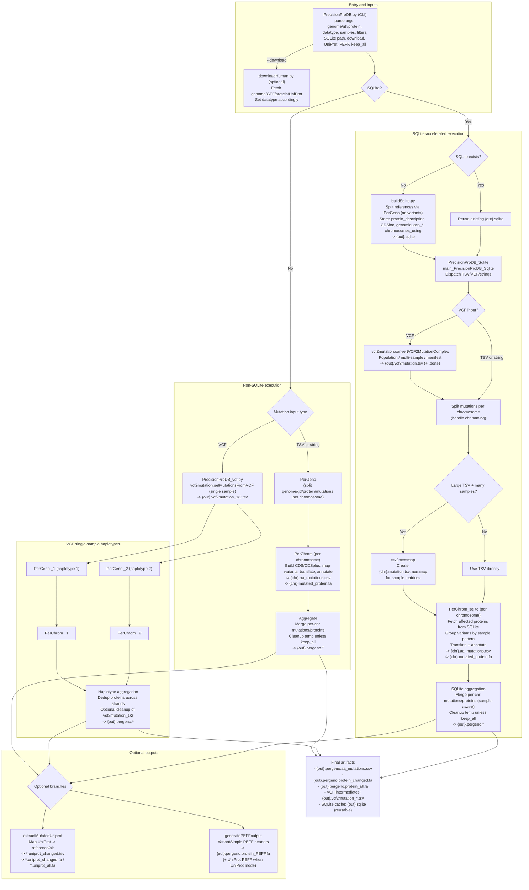

```mermaid
graph TD

%% Entry & inputs
subgraph "Entry and inputs"
  CLI["PrecisionProDB.py (CLI)
parse args: genome/gtf/protein, datatype, samples, filters,
SQLite path, download, UniProt, PEFF, keep_all"]
  DL["downloadHuman.py (optional)
Fetch genome/GTF/protein/UniProt
Set datatype accordingly"]
  ROUTE{SQLite?}

  CLI -->|"--download"| DL
  CLI --> ROUTE
end

%% Non-SQLite path
subgraph "Non-SQLite execution"
  VSEL{Mutation input type}
  VCF1["PrecisionProDB_vcf.py
vcf2mutation.getMutationsFromVCF (single sample)
-> {out}.vcf2mutation_1/2.tsv"]
  PGENO["PerGeno
(split genome/gtf/protein/mutations per chromosome)"]
  PCHROM["PerChrom (per chromosome)
Build CDS/CDSplus; map variants; translate; annotate
-> {chr}.aa_mutations.csv
-> {chr}.mutated_protein.fa"]
  AGG["Aggregate
Merge per-chr mutations/proteins
Cleanup temp unless keep_all
-> {out}.pergeno.*"]

  ROUTE -->|No| VSEL
  VSEL -->|VCF| VCF1
  VSEL -->|TSV or string| PGENO

  PGENO --> PCHROM --> AGG
end

%% VCF single-sample haplotype branch (non-SQLite)
subgraph "VCF single-sample haplotypes"
  PGENO_H1["PerGeno _1 (haplotype 1)"]
  PGENO_H2["PerGeno _2 (haplotype 2)"]
  PCHROM_H1["PerChrom _1"]
  PCHROM_H2["PerChrom _2"]
  AGGV["Haplotype aggregation
Dedup proteins across strands
Optional cleanup of vcf2mutation_1/2
-> {out}.pergeno.*"]

  VCF1 --> PGENO_H1 --> PCHROM_H1 --> AGGV
  VCF1 --> PGENO_H2 --> PCHROM_H2 --> AGGV
end

%% SQLite path
subgraph "SQLite-accelerated execution"
  SQLITE{SQLite exists?}
  BUILD["buildSqlite.py
Split references via PerGeno (no variants)
Store: protein_description, CDSloc, genomicLocs_*, chromosomes_using
-> {out}.sqlite"]
  SKIPBUILD["Reuse existing {out}.sqlite"]

  RUNSQL["PrecisionProDB_Sqlite
main_PrecisionProDB_Sqlite
Dispatch TSV/VCF/strings"]

  VCFPOP{VCF input?}
  POPCONV["vcf2mutation.convertVCF2MutationComplex
Population / multi-sample / manifest
-> {out}.vcf2mutation.tsv (+ .done)"]
  SPLITTSV["Split mutations per chromosome
(handle chr naming)"]

  MEM{Large TSV + many samples?}
  MEMMAP["tsv2memmap
Create {chr}.mutation.tsv.memmap
for sample matrices"]
  NOMAP["Use TSV directly"]

  PSQ["PerChrom_sqlite (per chromosome)
Fetch affected proteins from SQLite
Group variants by sample pattern
Translate + annotate
-> {chr}.aa_mutations.csv
-> {chr}.mutated_protein.fa"]

  AGGSQL["SQLite aggregation
Merge per-chr mutations/proteins (sample-aware)
Cleanup temp unless keep_all
-> {out}.pergeno.*"]

  ROUTE -->|Yes| SQLITE
  SQLITE -->|No| BUILD --> RUNSQL
  SQLITE -->|Yes| SKIPBUILD --> RUNSQL

  RUNSQL --> VCFPOP
  VCFPOP -->|VCF| POPCONV --> SPLITTSV
  VCFPOP -->|TSV or string| SPLITTSV

  SPLITTSV --> MEM
  MEM -->|Yes| MEMMAP --> PSQ
  MEM -->|No| NOMAP --> PSQ

  PSQ --> AGGSQL
end

%% Optional branches
subgraph "Optional outputs"
  OPT{Optional branches}
  UPROT["extractMutatedUniprot
Map UniProt -> reference/alt
-> *.uniprot_changed.tsv
-> *.uniprot_changed.fa / *.uniprot_all.fa"]
  PEFF["generatePEFFoutput
VariantSimple PEFF headers
-> {out}.pergeno.protein_PEFF.fa
(+ UniProt PEFF when UniProt mode)"]
end

AGG --> OPT
AGGV --> OPT
AGGSQL --> OPT
OPT --> UPROT
OPT --> PEFF

%% Final outputs
OUTS["Final artifacts
- {out}.pergeno.aa_mutations.csv
- {out}.pergeno.protein_changed.fa
- {out}.pergeno.protein_all.fa
- VCF intermediates: {out}.vcf2mutation_*.tsv
- SQLite cache: {out}.sqlite (reusable)"]

AGG --> OUTS
AGGV --> OUTS
AGGSQL --> OUTS
```
